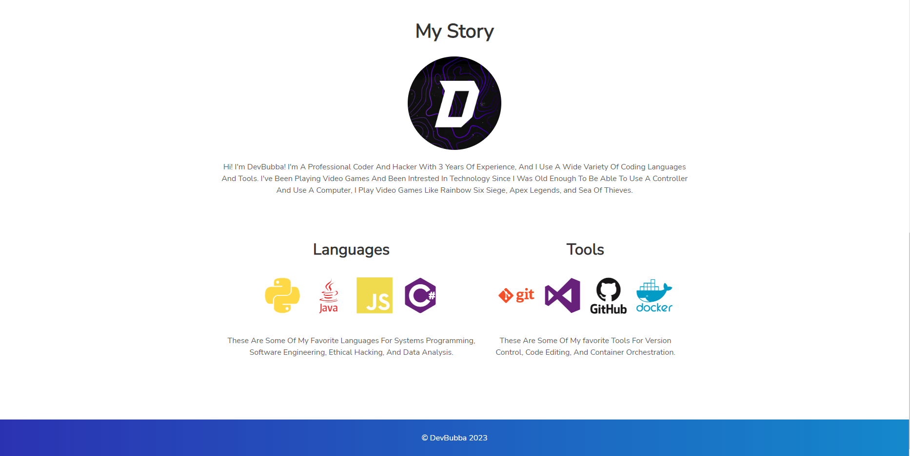
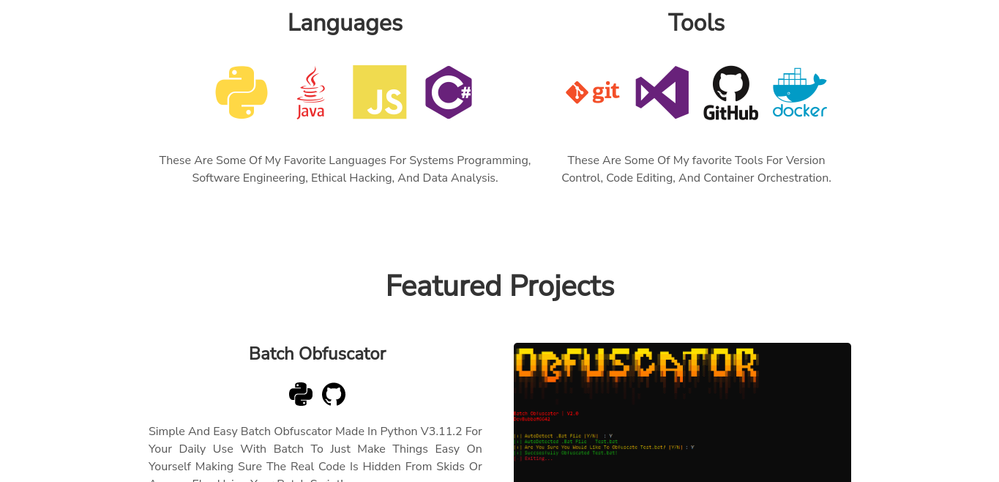
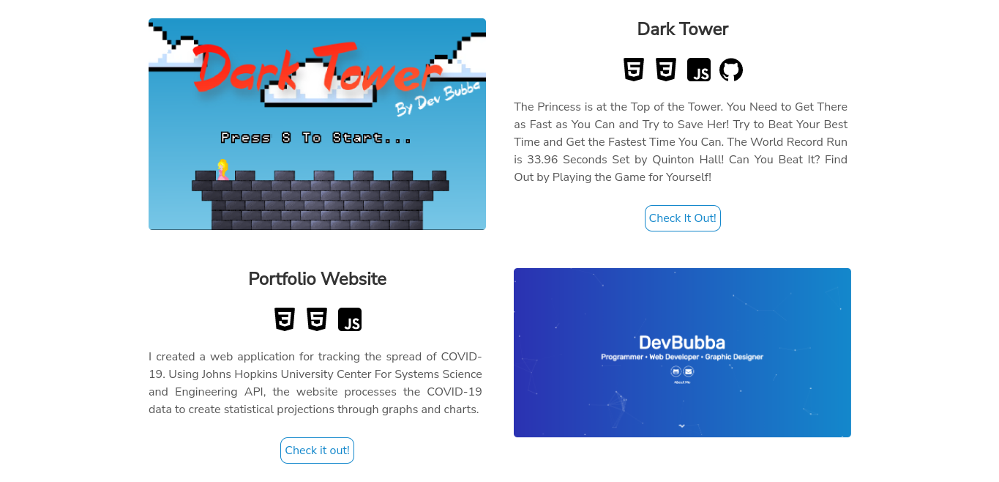

    
    
     
     
    
     

#  💻 〢 My Portfolio
My Own Simple And Modern Portfolio Made In HTML, CSS, And JavaScript!

## 🌐 〢 Table Of Contents

- **[📖 〢 Description](#description)**
- **[🔰 〢 Features](#features)**
- **[🔗 〢 Discord](https://discord.gg)**
- **[📷 〢 Preview](#preview)**
- **[🧾 〢 Lisence](#lisence)**

##  🔰 〢 Features

- `My Socail Links`🟢
- `About Me Bio`🟢
- `Top Languages I Use`🟢
- `Top Tools I Use`🟢
- `Featured Projects`🟢
- `Add Working Discord Server Link`🟡
- `Unblocked Games`🟡
- `Website Comments`🔴

🟢 = Working  | 🟡 = To Do  | 🔴 = Not Working

##  📷 〢 Preview

    
    
    </img>
    </img>
    </img>
    
 

## 🧾  License

### devbubba.github.io is licensed under the <a href="https://mit-license.org/.">MIT License</a>

