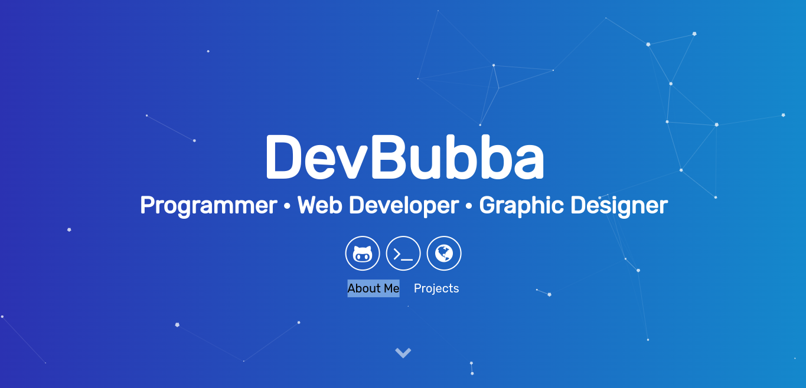

  

    
    
     
     
    
     
    <a href="https://devbubba.github.io">Open Portfolio</a>

# 💻 Devbubba's Portfolio

### My Own Simple And Modern Portfolio I Made In HTML, CSS, And JavaScript

# 📷 Preview

  

## ⚠️ Bugs?

-   Make An [issue](https://github.com/DevBubba/Dark-Tower/issues)
-   Join The [Discord](https://discord.gg/) **Discord Invite Is Invalid Untill I Can Make An Offical Discord Server**

# 🧾 License

### devbubba.github.io is licensed under the <a href="https://mit-license.org/">MIT License</a>

